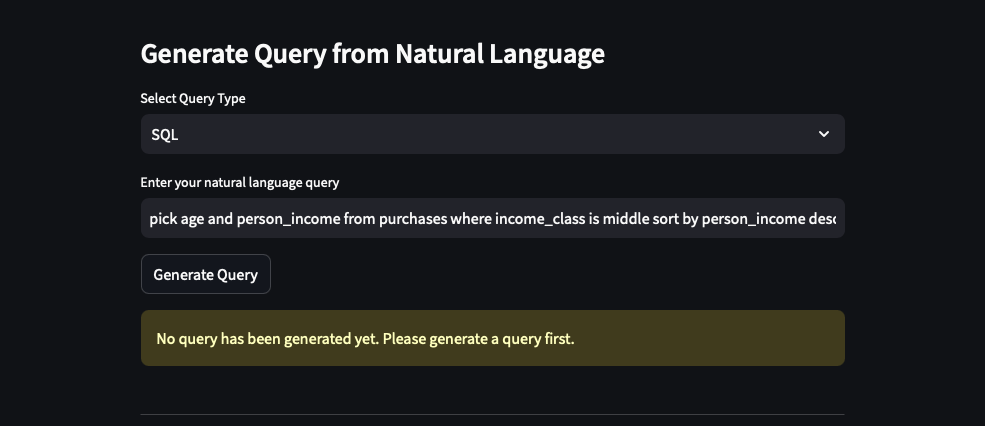
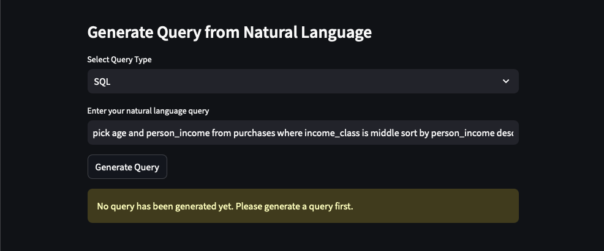
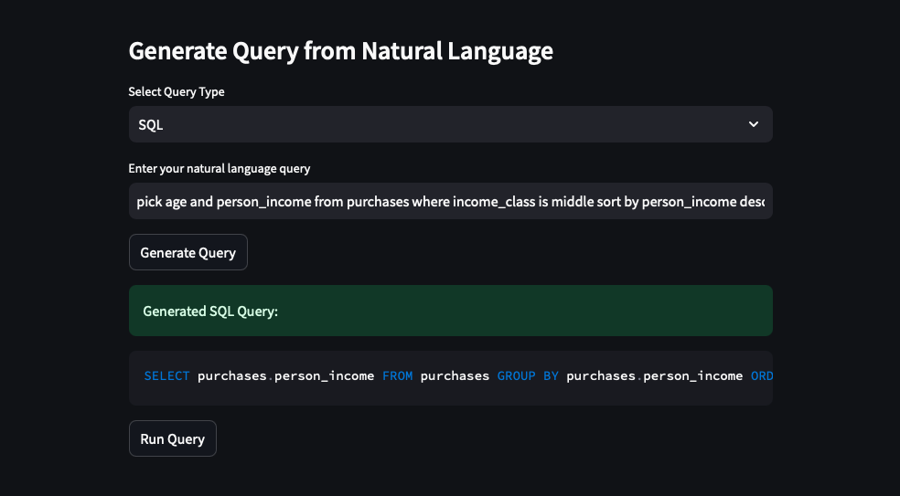

# README

---

# Directory Structure

DSCI551\_Final\_Project  
└── DSCI551\_README.pdf		\[README file that details how to get started with the ChatDB system.\]  
└── src					\[Directory that contains scripts and requirements.txt file.\]  
    ├── MongoDBCodeGenerator.py		\[Script that implements the MongoDB natural language query translation.\]  
    ├── SQLCodeGenerator.py		\[Script that implements the SQL natural language query translation.\]  
    ├── convert\_csv\_to\_json.py		\[Utility script that converts CSV rows to JSON documents.\]  
    ├── data\_set\_processor.py		\[Script that loads data to the databases and retrieves schema information.\]  
    ├── frontendv7.1.py			\[Script that provides the user interface.\]  
    ├── query\_executor.py			\[Script that executes and retrieves results from the database instances.\]  
    ├── requirements.txt			\[Packages that must be installed prior to executing the scripts.\]  
    └── sample\_queries.py			\[Script that contains natural language queries that have been filtered.\]  
└── data				\[Directory that contains CSV data for MySQL and JSON data for MongoDB.\]  
    ├── loan.csv  
    ├── loan.json  
    ├── purchases.csv  
    ├──  purchases.json  
    ├── salaries.csv  
    └── salaries.json

---

# Environment

This is the environment configuration that must be configured prior to executing this project.

## Python

This project assumes that the Python environment is set up according to:

1. Version: 3.11.10  
2. The packages in the requirements.txt file found in the project directory are installed with the command:   
   pip install \-r /path/to/requirements.txt  
3. NOTE: The packages that are most important to replicate this project are validated using this command

## Database Configuration

This project assumes that the following database systems are installed:

1. MySQL, Version: 8.0.39  
2. MongoDB, Version: 8.0.1

### MySQL Configuration

This project assumes that the MySQL database system is configured using the following commands.

1. Create a user:

   CREATE USER 'dsci551user'@'localhost' IDENTIFIED WITH mysql\_native\_password BY 'Dsci-Project';

2. Create a database:

CREATE DATABASE dsci551project;

3. Grant privileges to user:

   GRANT CREATE, ALTER, DROP, INSERT, UPDATE, DELETE, SELECT ON dsci551project.\* TO 'dsci551user'@'localhost' WITH GRANT OPTION;

4. Flush the privileges:

FLUSH PRIVILEGES;

5. Restart the database

### Data Sets

The data sets that were used (and altered) for this project are:

1. Loan Approval Classification

[https://www.kaggle.com/datasets/taweilo/loan-approval-classification-data](https://www.kaggle.com/datasets/taweilo/loan-approval-classification-data)

2. Data Science Salaries 

[https://www.kaggle.com/datasets/yusufdelikkaya/datascience-salaries-2024](https://www.kaggle.com/datasets/yusufdelikkaya/datascience-salaries-2024)

3. Predict Customer Purchase Behavior

[https://www.kaggle.com/datasets/rabieelkharoua/predict-customer-purchase-behavior-dataset](https://www.kaggle.com/datasets/rabieelkharoua/predict-customer-purchase-behavior-dataset)

### Data Format Assumptions

1. MySQL assumptions:   
   1. The name of the file will be the name of the table.  
   2. The first row in a CSV file contains the column names.  
   3. The column names with a suffix of '\_id' is a primary key (NOT SUPPORTED).  
   4. If a table with the same name is uploaded more than once, then the current table will be replaced with new table information.  
2. MongoDB assumptions:  
   1. The JSON file is formatted as:

    {  
        "Table\_Name": \[  
            {  
                "Feature1" : Data1,  
                …  
                "FeatureN": DataN  
            },  
            …  
        \]  
    }

2. The name of the collection is the name of the file.

---

# ChatDB

This is the procedure to start and execute the ChatDB system.

## Assumptions

1. The MySQL database is running.  
2. The MongoDb database is running.  
3. The user is executing the following commands in the same directory as the source code.  
4. The following data files are in the 'data' folder:  
1. purchases.csv, purchases.json  
2. salaries.csv, salaries.json  
3. loan.csv, loan.json

## User Interface

1. To run the ChatDB user interface, execute the following command:

streamlit run frontendv7.1.py

2. This will start a web browser that looks like this:

### Load Data

1. To load data into the MySQL database, scroll to the bottom of the user interface to the "Load Data into Database". Verify that MySQL is selected in the "Select Database for Data Load":

2. Click the "Browse files" button:

3. Choose a data set that has a ".csv" suffix and click "Upload" (or similar on other systems). For this example, 'loan.csv' is selected:

4. Click "Load Data", the following message signals success:

5. Follow steps 3-6 to load all '.csv' files.  
6. Refresh the browser, as necessary.  
7. These instructions are analogous for MongoDB (with '.json' files replacing '.csv' files).

### View SQL Data

1. To explore the information that has been previously loaded to the MySQL database, scroll to the "Explore Database" section and verify that SQL is selected as the database type:

2. Click the "Select a Table" drop-down menu and click on a table name. For example, this shows a snapshot of the "salaries" table in the database (use the horizontal scrollbar to view all columns):

3. NOTE: There are options to save the information, search for information in the snapshot and maximize the view that are available as icons when scrolling over the sample table..

### View MongoDB Data

1. After loading the '.json' files successfully into the database. Scroll to the "Explore Database" section and from the "Select Database Type to Explore" drop-down menu, choose "NoSQL".

2. The "Available Collections" menu will list the collections in the MongoDB database. For example, selecting the "salaries" collection will display the top document returned by the find query in JSON format:

3. NOTE: There are options available to copy the document to the clipboard for saving to local disk.

### Generate Random Queries

1. To generate a natural language query example, scroll to the "Sample Query" section:

2. Click the "Generate Sample Query" button to have a new query show in the text area above.  
3. NOTE: There is an option to copy to the clipboard when hovering over the text area.

### Execute Natural Language Queries

1. To generate an SQL query from a natural language query representation, scroll down to the "Generate Query from Natural Language" section:

2. Enter a natural language query based on the constructs defined in the project report.  
3. Alternatively, copy a query from the "Sample Query" text box and paste it in the "Enter your natural language query" text area.  
4. For example, copy this natural language query: "pick age and person\_income from purchases where income\_class is middle sort by person\_income descending".

5. Click the "Generate Query" button. 

6. To view the results of the query, click the "Run Query" button.

7. Alternatively, generate a MongoDB query by selecting "MongoDB" from the "Select Query Type" drop-down menu.  
8. Click the "Generate Query" button:

9. Click the "Run Query" button to view the results of the query:

